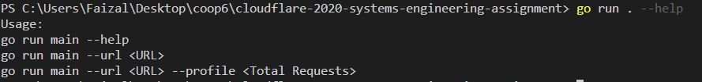
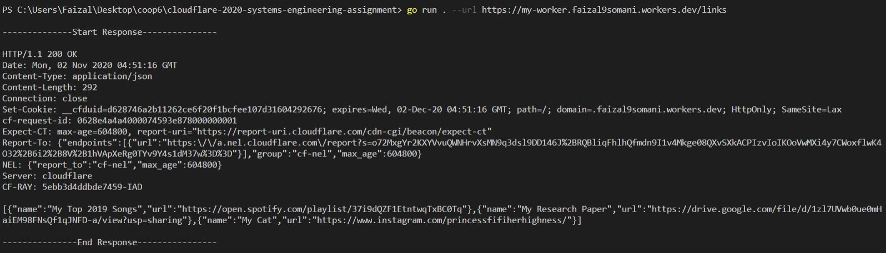
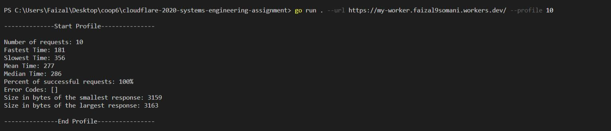
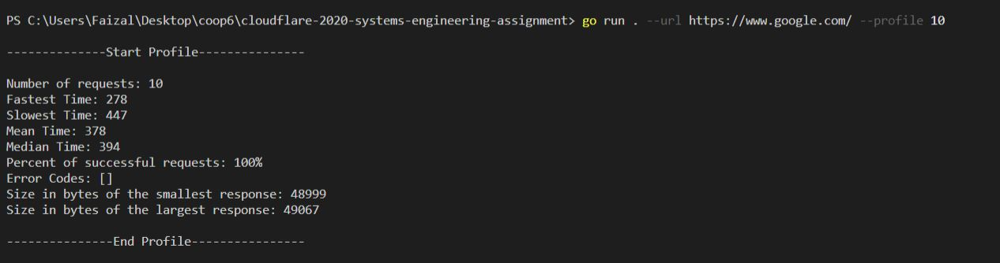
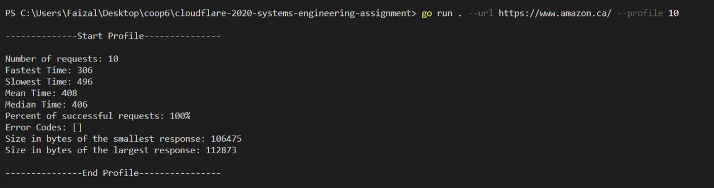
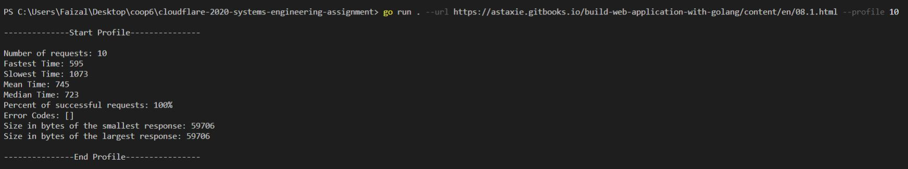

# Systems Assignment

## Usage

```sh
$ go run main --help
$ go run main --url <URL>
$ go run main --url <URL> --profile <Total Requests>
```

## Help



## Response for /links



## Profiles for different URLs









## Conclusion

My cloudflare website is pretty fast and one of the quickest. 
